# shop

E-Commerce App Prototype with Flutter & Supabase
The app includes:
• Modern and responsive UI with product browsing
• Authentication and database powered by Supabase
• State management with Cubit for clean and scalable code
• Cart and wishlist features for a smooth shopping experience
• Cool animations for better UX
• Location services and Flutter Maps integration
• An Admin page with full functionality to add, edit, delete, and confirm orders

## Prerequisites

- Flutter (stable) and Dart (bundled)
- Android Studio / Xcode or VS Code with Flutter plugin
- A connected device or emulator

## Getting started

1. Clone the repository:

```bash
git clone https://github.com/Ahmed4r/EcommerceApp.git
cd shop
```

2. Install dependencies:

```bash
flutter pub get
```

3. Run on a device or emulator:

```bash
flutter run
```

## Build

- Android (APK):

```bash
flutter build apk --release
```

- iOS (macOS required):

```bash
flutter build ios --release
```

## 🖼️ Screenshots

| Homepage                                     | Product Card                                        | Admin Dashboard                                            | Cart                                 | Category                                     |
| -------------------------------------------- | --------------------------------------------------- | ---------------------------------------------------------- | ------------------------------------ | -------------------------------------------- |
| 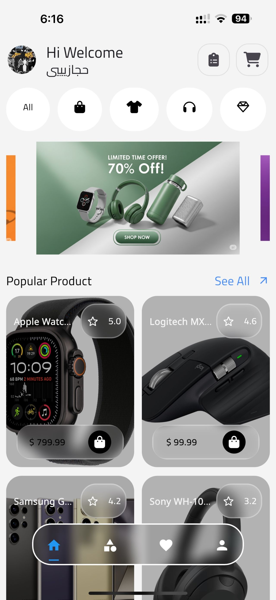 | 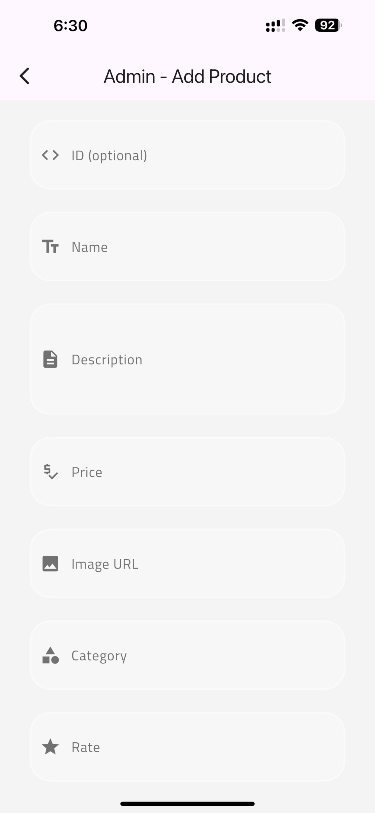 | 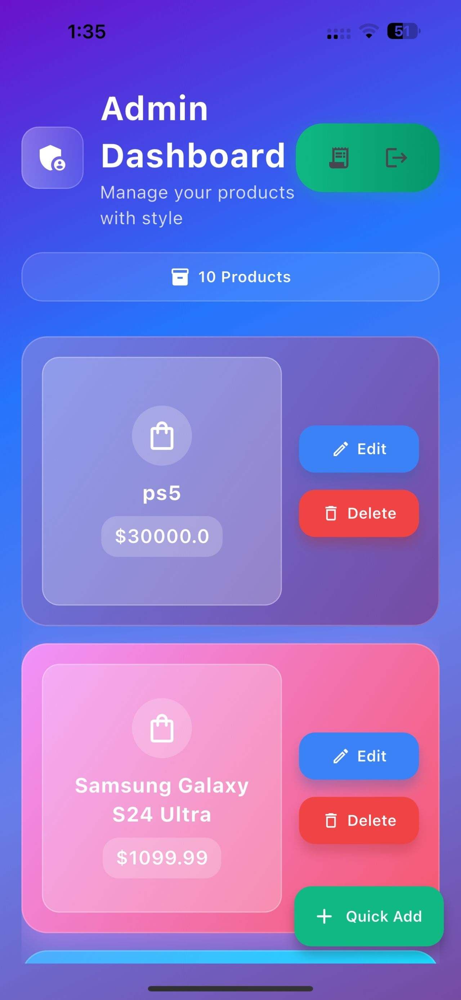 | 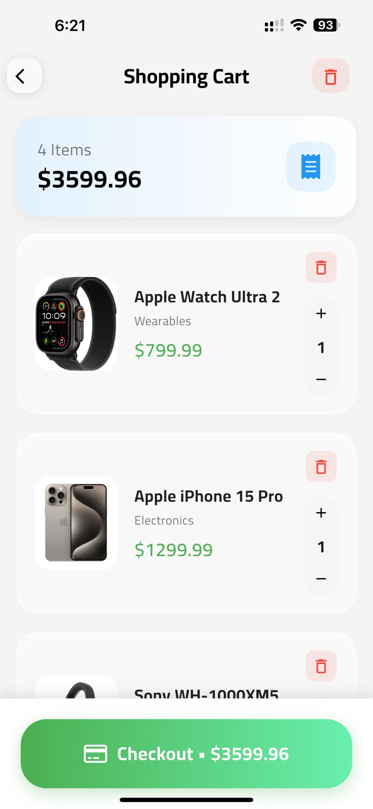 |  |

| Checkout                                     | Confirm Products                                             | Details                                    | Forget Password                                           | Login                                  |
| -------------------------------------------- | ------------------------------------------------------------ | ------------------------------------------ | --------------------------------------------------------- | -------------------------------------- |
| 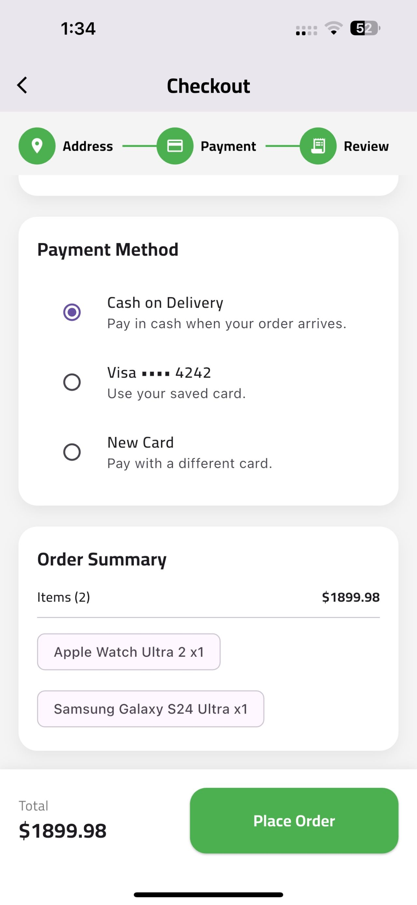 | 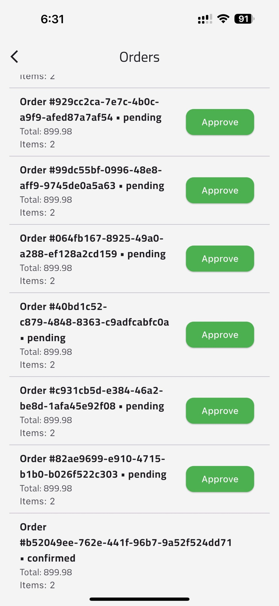 | 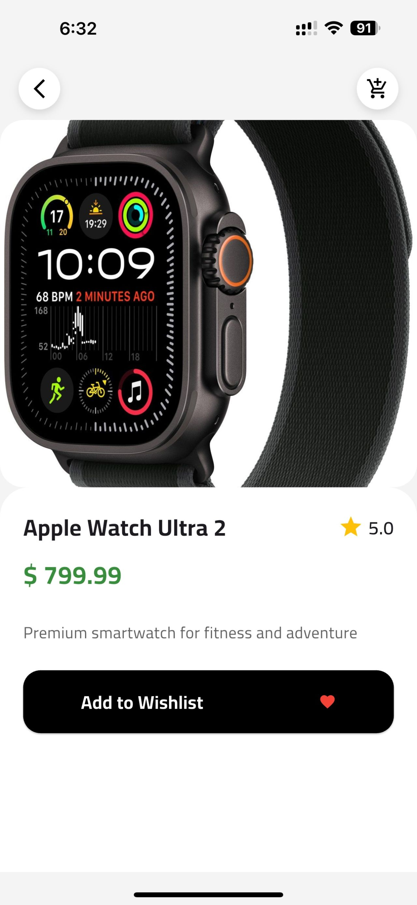 | 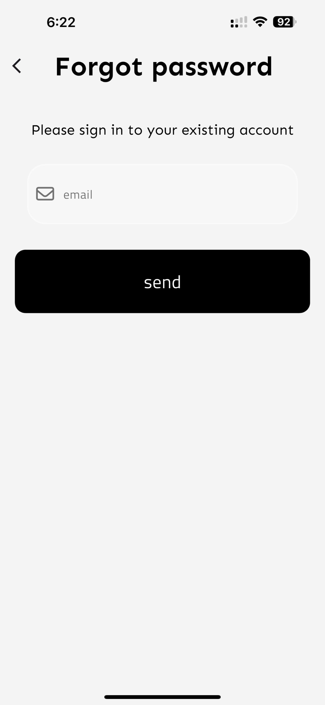 | 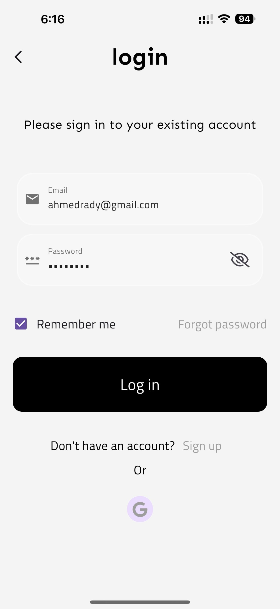 |

| Maps                                 | Profile                                    | Signup                                   | User Orders                                       | Wishlist                                     |
| ------------------------------------ | ------------------------------------------ | ---------------------------------------- | ------------------------------------------------- | -------------------------------------------- |
| 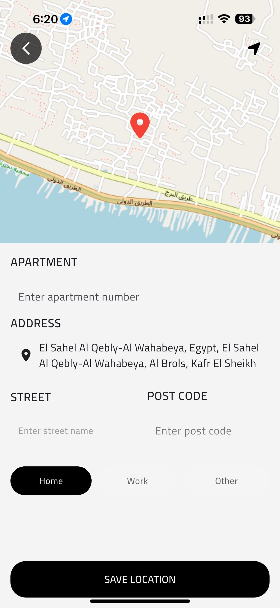 | 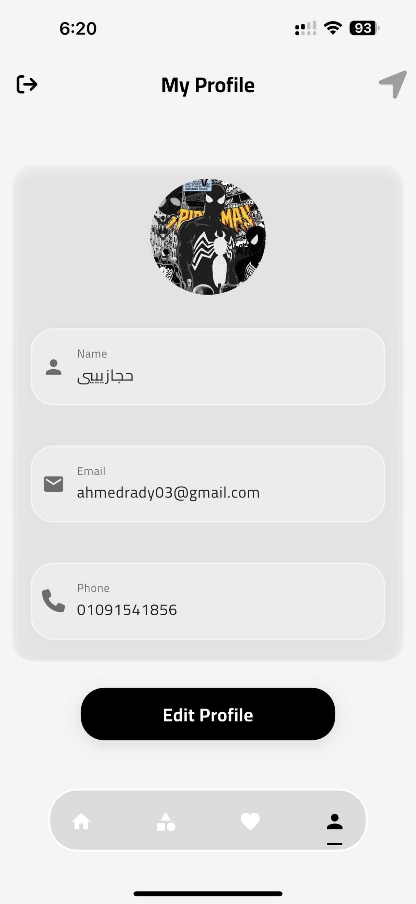 | 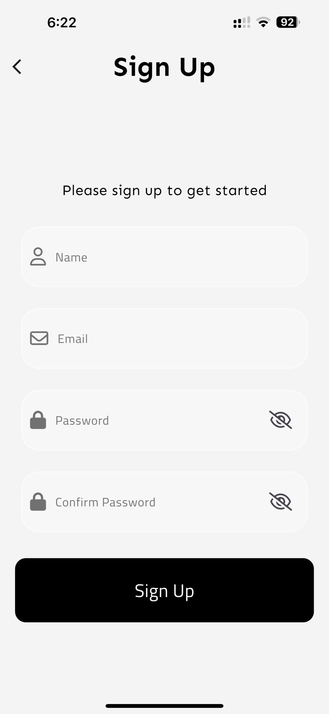 | 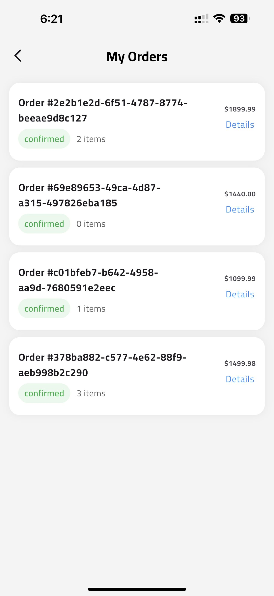 | 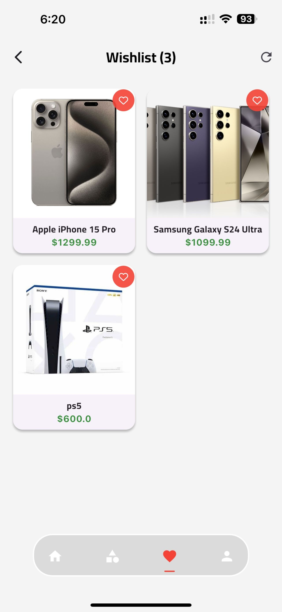 |

| Address                                    |
| ------------------------------------------ |
| 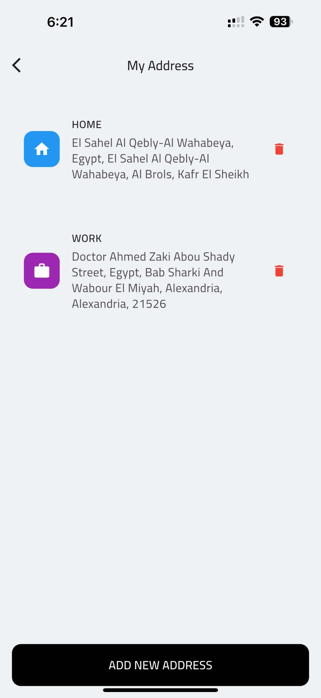 |

## Project layout (high level)

- lib/ — application source
  - main.dart — entry point
  - screens/ — UI screens
  - models/ — data models
  - widgets/ — reusable widgets
- assets/ — images, fonts, etc.

## Contributing

Contributions welcome. Open issues or pull requests and follow the existing code style.
