# shop

A simple Flutter e-commerce starter app.

## Prerequisites

- Flutter (stable) and Dart (bundled)
- Android Studio / Xcode or VS Code with Flutter plugin
- A connected device or emulator

## Getting started

1. Clone the repository:

```bash
git clone https://github.com/Ahmed4r/EcommerceApp.git
cd shop
```

2. Install dependencies:

```bash
flutter pub get
```

3. Run on a device or emulator:

```bash
flutter run
```

## Build

- Android (APK):

```bash
flutter build apk --release
```

- iOS (macOS required):

```bash
flutter build ios --release
```

## App Images

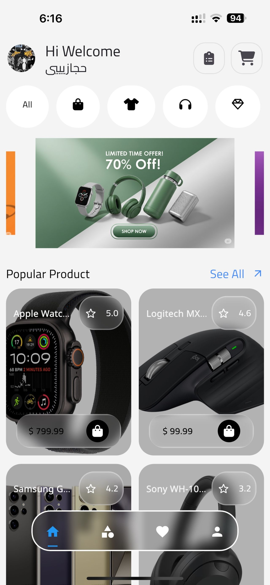
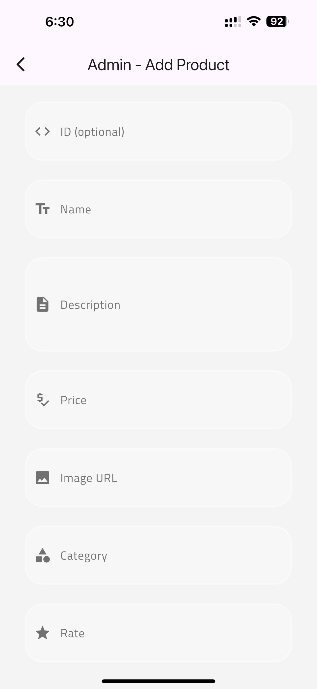
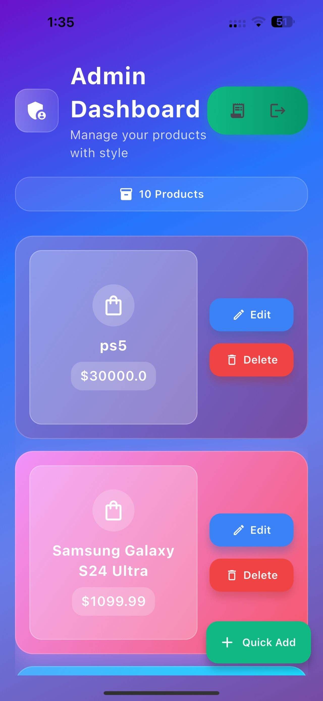
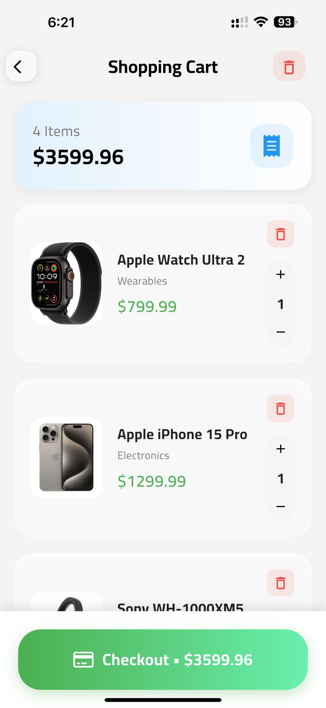
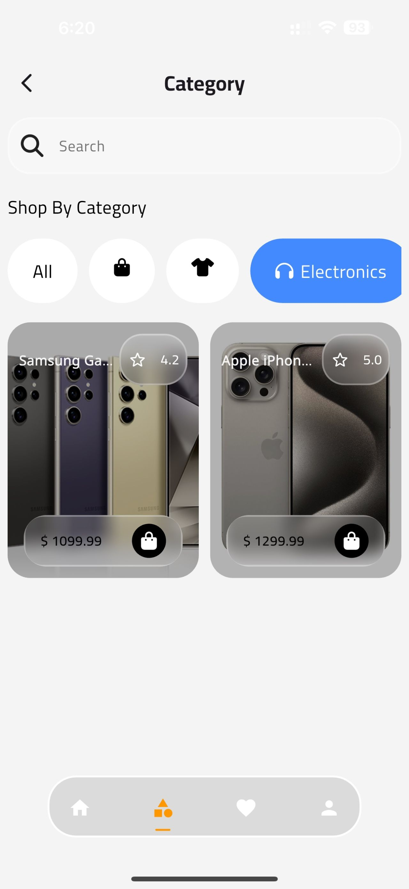
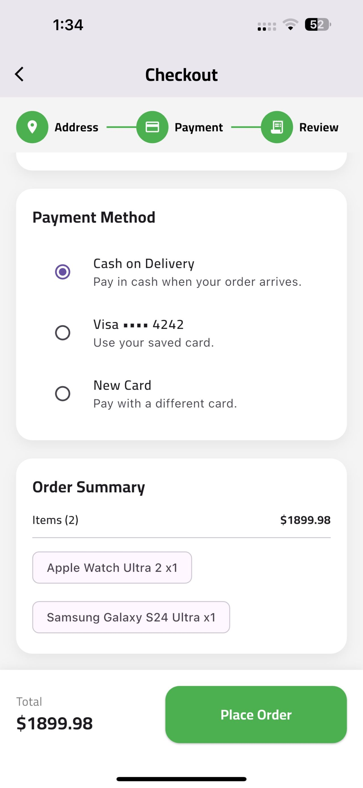
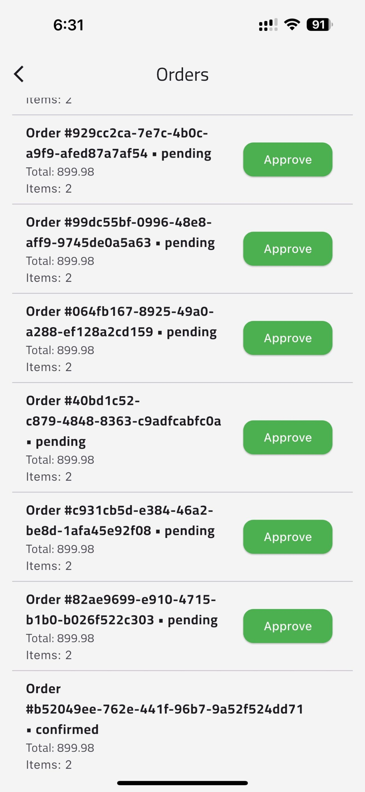
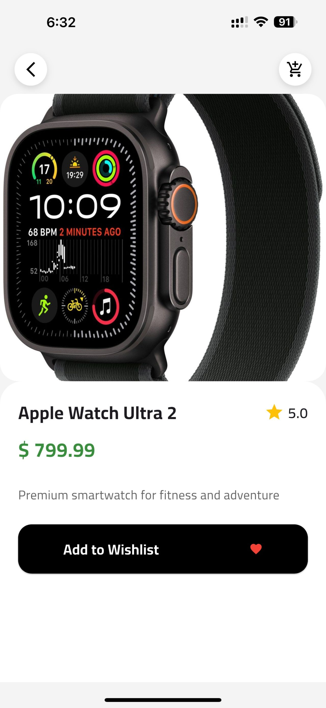
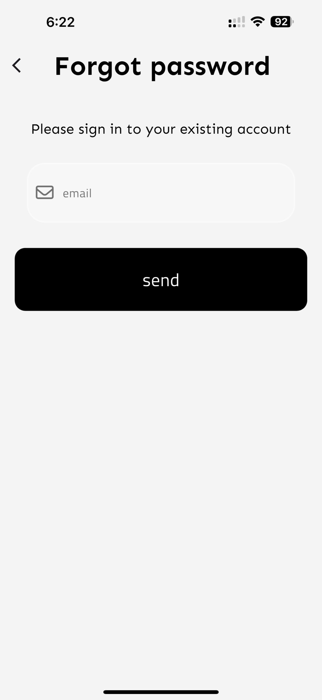

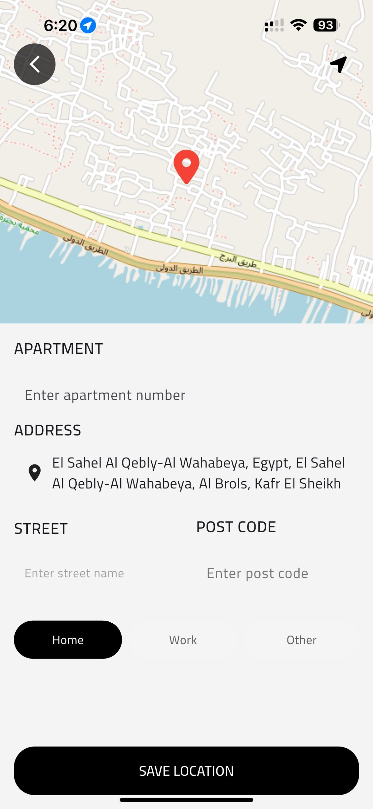
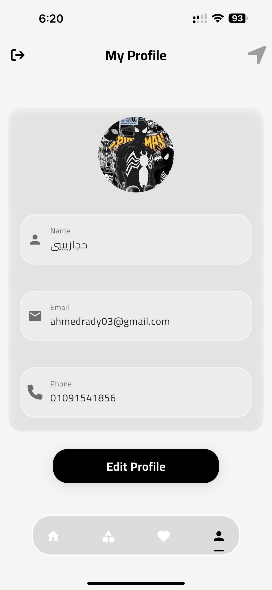
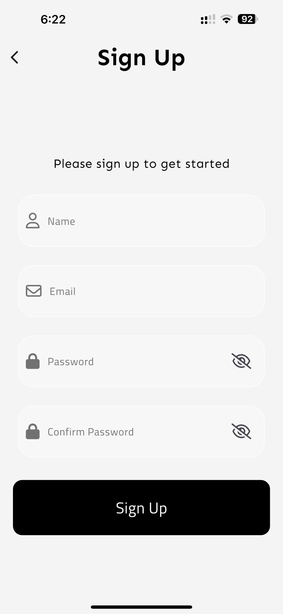
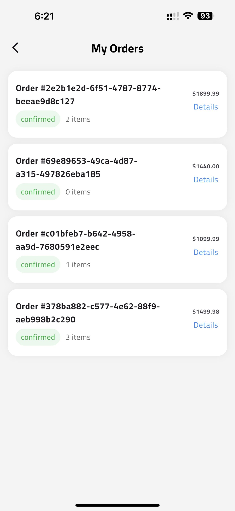
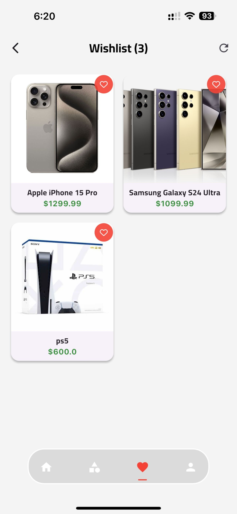
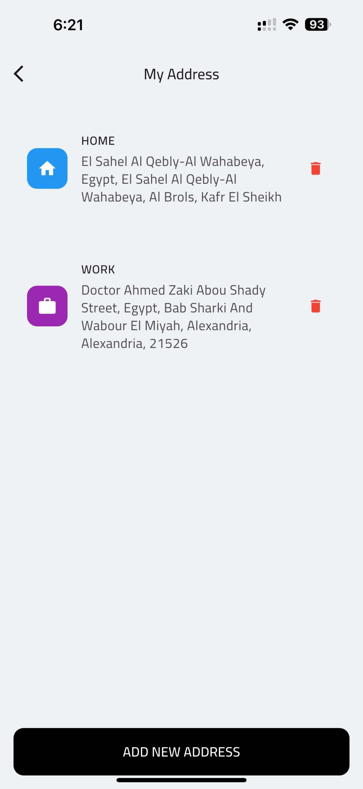

## Project layout (high level)

- lib/ — application source
  - main.dart — entry point
  - screens/ — UI screens
  - models/ — data models
  - widgets/ — reusable widgets
- assets/ — images, fonts, etc.

## Contributing

Contributions welcome. Open issues or pull requests and follow the existing code style.
